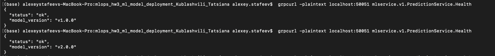
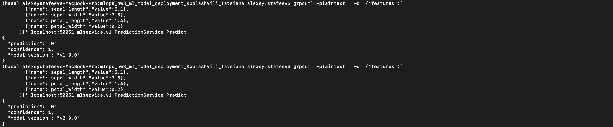
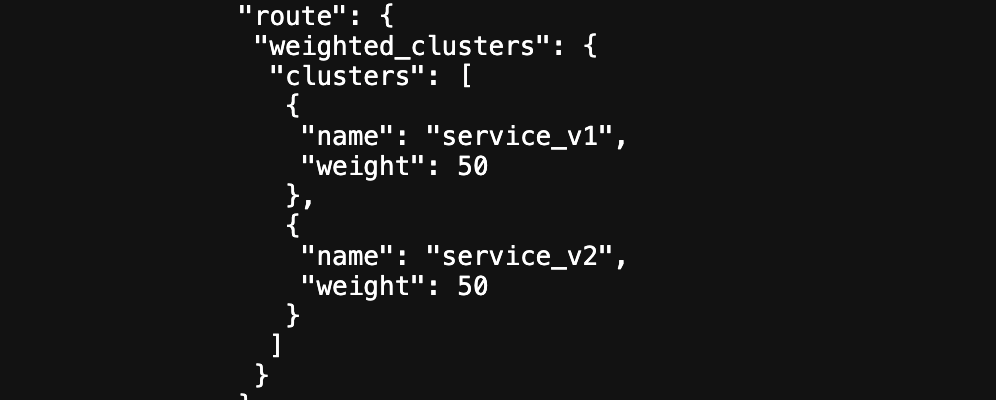
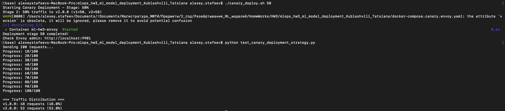

# ML gRPC Service — Canary Deployment

Домашнее задание №3: деплой gRPC-сервиса с ML-моделью и реализацией canary deployment.

**Автор:** Кублашвили Татьяна

Сервис реализует gRPC-API для инференса модели (классификация Iris) и предоставляет два основных эндпоинта:

- `/health` — проверка здоровья сервиса и информации о модели;
- `/predict` — предсказание класса и дополнительных метрик.

Проект включает две версии модели и инфраструктуру для поэтапного переключения трафика с v1 на v2 с помощью Envoy и стратегии **Canary**.

---

## 1. Стратегия деплоя: Canary Deployment

В проекте используются две версии одного ML-сервиса:

- **v1.0.0** — базовая модель (`models/model.pkl`);
- **v2.0.0** — улучшенная модель (`models/model_v2.pkl`).

Трафик распределяется между версиями с помощью Envoy (weighted clusters).  
Переключение долей трафика выполняется скриптом `canary_deploy.sh`.

Поддерживаемые этапы:

| Stage     | Трафик v1 | Трафик v2 | Команда                         |
|----------:|-----------|-----------|---------------------------------|
| `10`      | 90%       | 10%       | `./canary_deploy.sh 10`         |
| `50`      | 50%       | 50%       | `./canary_deploy.sh 50`         |
| `90`      | 10%       | 90%       | `./canary_deploy.sh 90`         |
| `100`     | 0%        | 100%      | `./canary_deploy.sh 100`        |
| `rollback`| 100%      | 0%        | `./canary_deploy.sh rollback`   |

Этапы позволяют постепенно увеличивать нагрузку на новую версию.  
При возникновении проблем доступен моментальный откат (rollback).

---

## 2. Структура репозитория

```text
.
├── Dockerfile
├── docker-compose.canary.envoy.yaml
├── envoy.yaml
├── project_bootstrap.sh
├── build_model_versions.sh
├── canary_deploy.sh
├── test_canary_deployment_strategy.py
│
├── protos/
│   ├── model.proto
│   └── health.proto
│
├── server/
│   ├── validaton.py
│   ├── inference.py
│   └── server.py
│
├── client/
│   └── client.py
│
├── models/
│   ├── model.pkl
│   └── model_v2.pkl
│
├── .github/
│   └── workflows/
│       └── deploy.yml
│
└── README.md
````

---

## 3. ML-модели

Обе модели обучаются на классическом датасете Iris.

**v1:**

* `RandomForestClassifier(n_estimators=100)`
* сохраняется как `model.pkl`.

**v2:**

* улучшенная версия (`n_estimators=200`, `max_depth=5`, др.)
* сохраняется как `model_v2.pkl`.

Обе модели автоматически генерируются через:

```bash
./project_bootstrap.sh
```

---

## 4. Быстрый запуск (локально)

### 4.1. Подготовка проекта

```bash
git clone <repo-url>
cd mlops_hw3_ml_model_deployment
./project_bootstrap.sh
```

Этот скрипт:

* устанавливает зависимости,
* обучает обе версии модели,
* генерирует gRPC-стабы,
* готовит структуру проекта.

### 4.2. Локальный запуск сервера

```bash
python -m server.server
```

---

## 5. Docker: сборка образов

Автоматическая сборка обеих версий:

```bash
./build_model_versions.sh
```

Образы:

* `ml-hw3-grpc-service:v1.0.0`
* `ml-hw3-grpc-service:v2.0.0`

---

## 6. Запуск canary-окружения

```bash
docker compose -f docker-compose.canary.envoy.yaml up -d
```

После старта:

* Envoy принимает внешние запросы,
* порт Envoy для gRPC доступен локально,
* панель Envoy Admin доступна по адресу:

```
http://localhost:9901
```

---

## 7. Управление canary-трафиком

Пошаговое переключение трафика:

```bash
./canary_deploy.sh 10
./canary_deploy.sh 50
./canary_deploy.sh 90
./canary_deploy.sh 100
./canary_deploy.sh rollback
```

Скрипт обновляет веса в `envoy.yaml` и рестартует Envoy.

---

## 8. Примеры вызовов gRPC

### 8.1. Проверка состояния — /health

```bash
grpcurl -plaintext \
  localhost:50051 \
  HealthService/Health
```

Пример ответа:

```json
{
  "status": "ok",
  "model_version": "v1.0.0"
}
```

---

### 8.2. Предсказание — /predict

```bash
grpcurl -plaintext \
  -d '{
        "features": [
          {"name": "sepal_length", "value": 5.1},
          {"name": "sepal_width",  "value": 3.5},
          {"name": "petal_length", "value": 1.4},
          {"name": "petal_width",  "value": 0.2}
        ]
      }' \
  localhost:50051 \
  mlservice.v1.PredictionService.Predict
```

Пример ответа:

```json
{
  "prediction": "0",
  "confidence": 0.98,
  "modelVersion": "v2.0.0"
}
```

---

## 9. Тестирование canary-распределения

```bash
python test_canary_deployment_strategy.py
```

Вывод примера:

```
=== Traffic Distribution ===
v1.0.0: 56 requests (56.0%)
v2.0.0: 44 requests (44.0%)
```

Так можно проверить, соответствует ли фактическое распределение заданным весам.

---

## 10. Скриншоты

По требованиям задания в репо должны быть скриншоты успешного деплоя:


*ответ /health*


*ответ /predict*


*состояние weighted clusters при тестировании Canary deployment (50/50)*


*локальный тест Canary deployment при распределении нагрузки 50/50*


*подтверждение успешного деплоя в GitHub*

---

## 11. CI/CD

Пайплайн в `.github/workflows/deploy.yml` выполняет:

* подготовку проекта,
* сборку Docker-образов,
* (опционально) пуш образов,
* деплой сервиса через docker-compose с canary-стратегией.
